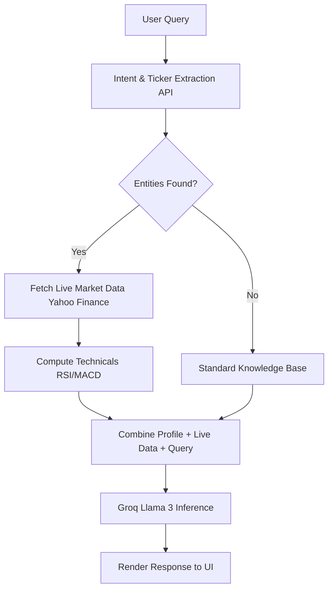

<h1 align="center">🧠 Neural Core Advisor</h1>
<h3 align="center"><em>The Next-Generation Automated Investment Insights Bot</em></h3>

<p align="center">
  <strong>Version 1.0.0</strong> | <strong>Status: Stable</strong> | <strong>License: MIT</strong>
</p>

<p align="center">
  <a href="https://reactjs.org/"></a>
  <a href="https://nodejs.org/"></a>
  <a href="https://www.mongodb.com/"></a>
  <a href="https://ai.meta.com/llama/"></a>
  <a href="https://tailwindcss.com/"></a>
  <a href="https://vitejs.dev/"></a>
</p>

---

## 📖 Table of Contents

1. [🌟 Introduction](#-introduction)
2. [✨ Core Features](#-core-features)
3. [🤖 AI Architecture &amp; Neural Engine](#-ai-architecture--neural-engine)
4. [🏗️ Technical Architecture](#️-technical-architecture)
5. [📂 File Structure](#-file-structure)
6. [🚀 Installation &amp; Setup](#-installation--setup)
7. [💻 How to Use](#-how-to-use)
8. [🔌 API Reference](#-api-reference)
9. [🎨 UI/UX Design System](#-uiux-design-system)
10. [🔮 Future Roadmap](#-future-roadmap)
11. [🤝 Contributing](#-contributing)
12. [📜 License](#-license)

---

## 🌟 Introduction

Welcome to the **Neural Core Advisor**, a state-of-the-art, AI-driven financial insights platform designed to bridge the gap between complex market data and intuitive user understanding.

This is not just another dashboard; it is a **Real-Time Retrieval-Augmented Generation (RAG) Engine** that actively monitors the stock market, performs technical analysis (RSI, MACD), and communicates with users through a highly intelligent LLM (Llama 3 70B via Groq) to provide actionable investment insights.

Wrapped in a stunning, premium **Glassmorphism & Kinetic Dark Mode** user interface, the application delivers a "wow" factor out of the box.

---

## ✨ Core Features

### 1. 🧠 AI-Powered RAG Engine

- **Intelligent Symbol Extraction:** Automatically detects stock tickers and company names from natural language queries.
- **Real-Time Context Injection:** Fetches live quotes and market caps on-the-fly and feeds them to the LLM.
- **Strict Guardrails:** The AI strictly operates within the finance domain. Any non-finance queries are met with a professional boundary.

### 2. 📊 Live Market Data & Technical Analysis

- **Yahoo Finance Integration:** Up-to-the-second market data via `yahoo-finance2`.
- **Algorithmic Audits:** Calculates Relative Strength Index (RSI), Short/Long Moving Averages, and MACD Momentum automatically to generate BULLISH, BEARISH, or NEUTRAL signals.
- **Dynamic Charting:** Injects live 30-day and 40-day trend data directly into the chat and dashboard via Recharts.

### 3. 💼 Advanced Portfolio Management

- **Live Syncing:** Your portfolio's value updates in real-time based on live market prices.
- **Sector Breakdown:** Categorizes holdings and calculates total equity, average cost, and profit/loss margins.

### 4. 🛡️ User Risk Profiling & Authentication

- **Secure JWT Auth:** Full end-to-end encryption with bcrypt for passwords.
- **Comprehensive Onboarding:** Assesses Net Worth, Liquidity Ratios, Source of Wealth, and Risk Tolerance to build a bespoke financial persona.

---

## 🤖 AI Architecture & Neural Engine

The Neural Core Advisor is built on a multi-stage **Retrieval-Augmented Generation (RAG)** pipeline optimized for sub-second latency.

### The 4-Step Pipeline

1. **Intent & Entity Extraction (Groq / Llama 3 70B):**

   - The user's query is sent to a specialized extraction model.
   - It identifies company names (e.g., "Apple", "Reliance") and maps them to their respective tickers (e.g., `AAPL`, `RELIANCE.NS`).
   - Categorizes intent: Is the user asking for an *audit*? A *trend*? Or general *advice*?
2. **Real-Time Data Retrieval (Yahoo Finance):**

   - Based on extracted tickers, the backend concurrently fetches live market prices, P/E ratios, historical chart data, and market capitalization.
3. **Technical Computation Engine:**

   - For audit requests, the server calculates:
     - `14-day RSI` (Relative Strength Index)
     - `12-day vs 26-day MACD` (Moving Average Convergence Divergence)
   - These signals are quantified and packaged into a readable context string.
4. **Generation & Guardrails:**

   - The original query, combined with the live data and user's risk profile, is sent back to the Llama 3 model.
   - The model generates a highly accurate, context-aware, and personalized financial response.



---

## 🏗️ Technical Architecture

### Frontend Layer (Client)

- **Framework:** React 19 + Vite for ultra-fast HMR and building.
- **Styling:** Tailwind CSS 4.2 with an extensive custom configuration for Kinetic Dark Mode and Neon accents.
- **Animations:** Framer Motion for smooth, hardware-accelerated transitions.
- **State Management:** React Context API + Custom Hooks.
- **Icons & Charts:** Lucide React and Recharts.

### Backend Layer (Server)

- **Runtime:** Node.js v20+ with Express.js 5.x.
- **Database:** MongoDB (via Mongoose 9.5) for persistent storage of users and portfolios.
- **AI Gateway:** Groq SDK for lightning-fast LLM inference.
- **Security:** bcrypt, jsonwebtoken, CORS.

---

## 📂 File Structure

An exhaustive look at the project's organization to help developers navigate seamlessly.

```text
Neural_Core_Advisor/
├── backend/
│   ├── data/                   # JSON persistence fallbacks
│   ├── middleware/             # Express middlewares
│   │   └── auth.js             # JWT Verification
│   ├── models/                 # Mongoose Schemas
│   │   ├── Portfolio.js        # Portfolio data structure
│   │   └── User.js             # User data & risk profiles
│   ├── routes/                 # Express API Routers
│   │   └── auth.js             # /api/auth endpoints
│   ├── .env                    # Environment variables (GROQ_API_KEY, MONGODB_URI)
│   ├── index.js                # Main Server Entry Point (RAG Engine & Market APIs)
│   └── package.json            # Node dependencies
│
├── frontend/
│   ├── public/                 # Static assets
│   ├── src/
│   │   ├── components/         # Reusable UI Components
│   │   │   ├── AdvisorPage.jsx # AI Chat Interface
│   │   │   ├── Chat.jsx        # Floating Chat Widget
│   │   │   ├── Dashboard.jsx   # Main Statistics Dashboard
│   │   │   ├── Modals.jsx      # Insight, Trade, Notification Modals
│   │   │   ├── Portfolio.jsx   # Asset Management View
│   │   │   ├── ProfileForm.jsx # Onboarding & Risk Assessment
│   │   │   └── Sidebar.jsx     # Navigation Menu
│   │   ├── context/            # Global State Management
│   │   │   └── AuthContext.jsx # User Session State
│   │   ├── pages/              # Top-level Page Components
│   │   │   └── AuthPage.jsx    # Login / Register Screen
│   │   ├── index.css           # Tailwind Entry & Custom Theme Tokens
│   │   ├── main.jsx            # React Entry Point
│   │   └── App.jsx             # Main Application Router & Layout
│   ├── .env                    # Frontend Environment Variables
│   ├── package.json            # React/Vite dependencies
│   ├── postcss.config.js       # PostCSS configuration
│   └── vite.config.js          # Vite bundler configuration
│
└── README.md                   # You are here!
```

---

## 🚀 Installation & Setup

Follow these steps meticulously to get the Neural Core Advisor running on your local machine.

### Prerequisites

- Node.js (v18.x or v20.x recommended)
- MongoDB Database (Local or MongoDB Atlas cluster)
- Groq API Key (for Llama 3 70B inference)

### Step 1: Clone & Install

Open your terminal and execute:

```bash
# Navigate to the project directory
cd skillBased

# Install backend dependencies
cd backend
npm install

# Install frontend dependencies
cd ../frontend
npm install
```

### Step 2: Environment Configuration

**Backend `.env`:**
Create a `.env` file in the `backend/` directory:

```env
PORT=5002
MONGODB_URI=mongodb+srv://<your_user>:<your_password>@cluster.mongodb.net/neural_advisor
JWT_SECRET=your_super_secret_jwt_key
GROQ_API_KEY=gsk_your_groq_api_key_here
```

**Frontend `.env`:**
Create a `.env` file in the `frontend/` directory:

```env
VITE_API_URL=http://localhost:5002/api
```

### Step 3: Launching the Engines

Start the Backend Server (Terminal 1):

```bash
cd backend
npm run dev
# Output: Connected to Neural Database (MongoDB)
# Output: Neural Ultra-Stable Server running on port 5002
```

Start the Frontend Application (Terminal 2):

```bash
cd frontend
npm run dev
# Output: VITE v8.0.10 ready in XXX ms
# Output: Local: http://localhost:5173/
```

---

## 💻 How to Use

The application is designed to be highly intuitive. Here is the workflow:

1. **Authentication:**

   - Launch `http://localhost:5173`.
   - Create a new account or sign in.
2. **Onboarding & Profiling:**

   - Navigate to the **"Risk Profile"** tab.
   - Fill out your income range, net worth, liquidity ratio, and risk tolerance.
   - *Pro-Tip:* The AI will use this data to tailor its investment advice specifically to your financial situation.
3. **Building the Portfolio:**

   - Go to the **"Portfolio"** tab.
   - Click "Add Asset" (or use the Trade Modal).
   - Enter a valid ticker (e.g., `NVDA`, `MSFT`, `TCS.NS`) and your average cost.
   - Watch as the system fetches live prices and calculates your real-time P/L.
4. **Consulting the AI Advisor:**

   - Navigate to **"AI Advisor"**.
   - Ask complex questions like:
     - *"Can you give me a technical audit of TSLA?"*
     - *"What is the 30-day trend for AAPL?"*
     - *"Based on my risk profile, should I invest in crypto or index funds?"*
   - The AI will fetch live data, process technical indicators, and respond with a visually appealing, data-backed answer.

---

## 🔌 API Reference

The backend provides a robust REST API for integrating with other services.

### Auth & User

- `POST /api/auth/register` - Register a new user
- `POST /api/auth/login` - Authenticate & receive JWT
- `GET /api/profile` - Fetch authenticated user's risk profile
- `POST /api/profile` - Update risk profile parameters

### Portfolio

- `GET /api/portfolio` - Fetch portfolio with LIVE market prices
- `POST /api/portfolio` - Add a new asset to the portfolio

### Market Data

- `GET /api/market/:symbol` - Get live quote for a specific ticker
- `GET /api/market/:symbol/history` - Get 40-day historical chart data

### Neural Engine (AI)

- `POST /api/chat` - Interact with the RAG pipeline.
  - **Body Payload:** `{ "message": "user query", "history": [] }`
  - **Response:** `{ "reply": "AI response containing potential [CHART_DATA] tags" }`

---

## 🎨 UI/UX Design System

The platform utilizes a **"Kinetic Glassmorphism"** design system to deliver a truly premium experience.

- **Color Palette:**

  - `Surface Dark`: `#0A0A0B` (Deep Space Black)
  - `Neon Green`: `#00FF94` (Primary Accent, signifies growth)
  - `Neon Purple`: `#B535F6` (Secondary Accent, AI operations)
  - `Text Primary`: `#E3E1E9` (Soft White for readability)
- **Components:**

  - Translucent panels with deep blurs (`backdrop-blur-xl`).
  - Subtle glowing borders on hover to indicate interactivity.
  - Micro-animations using Framer Motion (spring physics) for modal openings, chart rendering, and tab switching.

---

## 🔮 Future Roadmap

- [ ] **WebSockets Integration:** For true streaming of live tick data without HTTP polling.
- [ ] **Multi-Agent Swarm:** Deploying specialized sub-agents (e.g., Sentiment Analyst, Technical Analyst, Fundamental Analyst) that debate before giving a final recommendation.
- [ ] **Brokerage Linking:** OAuth integration with Robinhood, Zerodha, or Alpaca for direct trade execution.
- [ ] **Mobile App:** React Native port for iOS/Android.

---

## 🤝 Contributing

We welcome contributions to make the Neural Core Advisor even better!

1. Fork the repository.
2. Create a new branch (`git checkout -b feature/AmazingFeature`).
3. Commit your changes (`git commit -m 'Add some AmazingFeature'`).
4. Push to the branch (`git push origin feature/AmazingFeature`).
5. Open a Pull Request.

Please ensure your code passes all linting rules (`npm run lint` in the frontend) and that you do not expose any `.env` secrets in your commits.

---

---

<div align="center">
  <p>Built with ❤️ by the Neural Core Development Team.</p>
  <p><i>Empowering retail investors with institutional-grade intelligence.</i></p>
</div>
