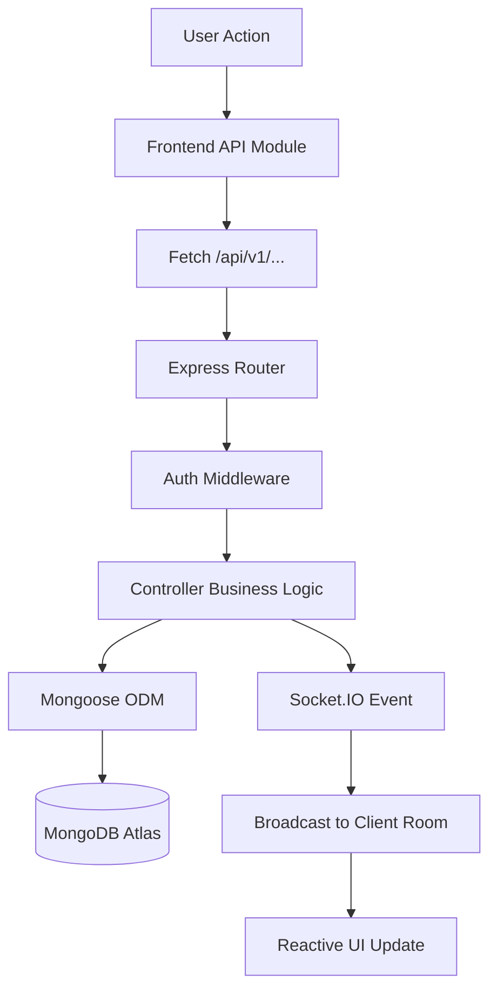

<h1 align="center">🚀 StartupEvents</h1>
<h3 align="center"><em>The Definitive Full-Stack Ecosystem for Startup Networking, Discovery, and Real-Time Collaboration</em></h3>

<p align="center">
  <strong>Version 1.0.0</strong> | <strong>Status: Stable</strong> | <strong>Deployment: Render/Vercel</strong>
</p>

<p align="center">
  <a href="https://javascript.info/"></a>
  <a href="https://nodejs.org/"></a>
  <a href="https://www.mongodb.com/"></a>
  <a href="https://socket.io/"></a>
  <a href="https://openai.com/"></a>
  <a href="https://vitejs.dev/"></a>
  <a href="https://www.typescriptlang.org/"></a>
</p>

---

## 📖 Table of Contents

1.  [🌟 Project Overview & Vision](#-project-overview--vision)
2.  [✨ Core Ecosystem Features](#-core-ecosystem-features)
    *   [Identity & Security](#1-identity--security)
    *   [Event Discovery Engine](#2-event-discovery-engine)
    *   [Organizer Suite](#3-organizer-suite)
    *   [Real-Time Collaboration](#4-real-time-collaboration)
3.  [🤖 AI Architect & Neural Matching](#-ai-architect--neural-matching)
4.  [🏗️ Technical Architecture Deep-Dive](#️-technical-architecture-deep-dive)
    *   [Frontend Logic Layer](#frontend-logic-layer)
    *   [Backend Infrastructure](#backend-infrastructure)
    *   [Real-Time Synchronization](#real-time-synchronization)
5.  [📂 Exhaustive File Structure](#-exhaustive-file-structure)
6.  [🚀 Detailed Installation & Setup](#-detailed-installation--setup)
    *   [Environment Variables](#environment-variables)
    *   [Database Seeding](#database-seeding)
7.  [💻 Comprehensive How to Use](#-comprehensive-how-to-use)
    *   [User Workflow](#user-workflow)
    *   [Organizer Workflow](#organizer-workflow)
    *   [Admin Workflow](#admin-workflow)
8.  [🔌 Extensive API Documentation](#-extensive-api-documentation)
    *   [Authentication Module](#authentication-module)
    *   [Event Module](#event-module)
    *   [AI & Analytics Module](#ai--analytics-module)
9.  [📊 Database Schema & Data Models](#-database-schema--data-models)
10. [🎨 UI/UX Design System: The Electric Curative](#-uiux-design-system-the-electric-curative)
11. [🛡️ Security & Protection Layer](#-security--protection-layer)
12. [⚡ Performance & Optimization](#-performance--optimization)
13. [🔮 Expanded Future Roadmap](#-expanded-future-roadmap)
14. [🤝 Detailed Contributing Guide](#-detailed-contributing-guide)
15. [❓ Frequently Asked Questions (FAQ)](#-frequently-asked-questions-faq)
16. [🏁 Conclusion](#-conclusion)

---

## 🌟 Project Overview & Vision

**StartupEvents** is an enterprise-grade networking platform designed specifically for the high-velocity startup ecosystem. In a world where networking is the primary currency for founders and builders, this platform serves as the digital hub for discovering **Hackathons**, **Pitch Nights**, **Workshops**, and **Conferences**.

Unlike generic event platforms, StartupEvents is built on a **Modular Vanilla JavaScript** foundation, proving that deep architectural patterns and high-performance logic can be achieved without the overhead of heavy frameworks like React or Angular.

### The Mission
> "To empower the next generation of innovators by providing a seamless, AI-driven, and real-time environment for professional discovery and collaboration."

---

## ✨ Core Ecosystem Features

### 1. Identity & Security
- **JWT-Powered Auth:** Stateless session management using JSON Web Tokens for high scalability.
- **RBAC (Role-Based Access Control):** Granular permissions for **Attendees**, **Organizers**, and **Admins**.
- **Secure Hashing:** Industry-standard bcrypt encryption for all user credentials.
- **Input Validation:** Strict server-side validation using `express-validator` to prevent injection and data corruption.

### 2. Event Discovery Engine
- **Kinetic Catalog:** A high-performance, responsive grid that handles hundreds of concurrent event listings.
- **Semantic Search:** Find events based on natural language queries, powered by AI embeddings.
- **Dynamic Filtering:** Instant categorization by tags: *Hackathons, Meetups, VC Pitch Nights, and Workshops*.
- **Live Counters:** Real-time stats showing active events, founders on site, and total community RSVPs.

### 3. Organizer Suite
- **Nerve Center Dashboard:** A data-rich command center for managing hosted events.
- **Event Lifecycle Tools:** Create, Preview, Edit, and Delete events with a specialized multi-step form.
- **Attendee Analytics:** View real-time ledgers of everyone who has RSVPed, including their professional interests.
- **"Danger Zone" Protection:** Guardrails for destructive actions requiring double-confirmation.

### 4. Real-Time Collaboration
- **Global Chat Engine:** Specialized WebSocket rooms for every single event.
- **Bi-directional Streaming:** Messages delivered in under 50ms across the platform.
- **Interactive Feedback:** Typing indicators, join/leave notifications, and toast alerts for new RSVPs.

---

## 🤖 AI Architect & Neural Matching

The "Brain" of StartupEvents is the **AI Architect**, which uses a sophisticated scoring algorithm to ensure users find the most relevant events for their career path.

### The Scoring Algorithm (Match Score)
The system calculates a **Match Score (0-100%)** using the following weighted parameters:
1.  **Interaction History (40%):** Analyzes your past 5 RSVPs to determine preferred categories.
2.  **Tag Synergy (30%):** Cross-references your profile interests (e.g., "AI", "Web3") with event tags.
3.  **City Proximity (20%):** Prioritizes events in your registered location.
4.  **Temporal Logic (10%):** Prioritizes upcoming events that fit your "Active Hours".

### Content Enhancement
- **AI Copilot:** Organizers can use the AI to turn a one-sentence idea into a professionally formatted event description.
- **Categorization Engine:** Automatically suggests tags and categories based on the event's title and description.

---

## 🏗️ Technical Architecture Deep-Dive

StartupEvents follows a **Modular Monolith** pattern on the backend and a **Module-Based SPA** pattern on the frontend.

### Frontend Logic Layer
- **Architecture:** Modular Vanilla JS (ES6).
- **Core Modules:**
  - `api.js`: Handles all asynchronous communication with the REST server.
  - `auth.js`: Manages tokens, login states, and route guarding.
  - `ui.js`: A reactive rendering engine using `DocumentFragments` for maximum DOM performance.
  - `socket.js`: Manages the lifecycle of WebSocket connections.

### Backend Infrastructure
- **Runtime:** Node.js v20.x.
- **Framework:** Express.js 5.x.
- **Security:** Helmet, CORS, and Rate-Limiting are implemented at the core level.
- **Real-Time:** Socket.IO handles the bidirectional communication bridge.



---

## 📂 Exhaustive File Structure

```text
startupEventApp/
├── backend/
│   ├── src/
│   │   ├── config/             # DB & Environment Configuration
│   │   ├── controllers/        # Business Logic (Auth, Event, AI, Analytics)
│   │   ├── middleware/         # Security, RBAC & Validation
│   │   ├── models/             # Mongoose Schemas (User, Event, RSVP, Review)
│   │   ├── routes/             # API Route Definitions
│   │   ├── scripts/            # Database Seeding & Maintenance
│   │   ├── utils/              # Global Helper Functions
│   │   └── server.js           # Server Entry Point
│   ├── tests/                  # Jest Unit & Integration Tests
│   ├── .env.example            # Environment Template
│   └── package.json            # Backend Dependencies
│
├── frontend/
│   ├── public/                 # Static Assets (Images, Icons)
│   ├── src/
│   │   ├── modules/            # Vanilla JS Business Logic
│   │   │   ├── api.js          # REST Client
│   │   │   ├── auth.js         # Session Guard
│   │   │   ├── ui.js           # Rendering Engine
│   │   │   └── socket.js       # Real-time Bridge
│   │   ├── styles/             # Kinetic CSS System
│   │   │   ├── variables.css   # Color Tokens
│   │   │   └── main.css        # Global Styles
│   │   ├── components/         # Reusable UI Partials
│   │   └── main.js             # Main Entry Point
│   ├── index.html              # App Shell
│   └── vite.config.js          # Bundler Configuration
│
└── README.md                   # Comprehensive Documentation
```

---

## 🚀 Detailed Installation & Setup

### Prerequisites
- **Node.js:** v18.x or v20.x.
- **MongoDB:** A running instance (Local or Atlas).
- **Git:** For version control.
- **OpenAI/Groq Keys:** Required for AI features.

### Step 1: Repository Setup
```bash
git clone https://github.com/enigmaAditya/startupEventApp.git
cd startupEventApp
```

### Step 2: Backend Configuration
```bash
cd backend
npm install
cp .env.example .env
# Edit .env with your MONGO_URI and JWT_SECRET
```

### Step 3: Frontend Configuration
```bash
cd ../frontend
npm install
# Vite handles environment variables automatically
```

### Step 4: Seeding (Optional)
If you want to test with pre-populated data:
```bash
cd ../backend
npm run seed
```

### Step 5: Launch the Platform
```bash
# Terminal 1: Backend
npm run dev

# Terminal 2: Frontend
cd ../frontend
npm run dev
```

---

## 💻 Comprehensive How to Use

### User Workflow
1.  **Onboarding:** Register and complete your interest profile. The AI uses this to rank events.
2.  **Discovery:** Use the "Smart Search" to find events. The Match Score will show your compatibility.
3.  **Interaction:** Click an event to enter the "Glass Room". Chat with other attendees and click "RSVP Secured!".

### Organizer Workflow
1.  **Verification:** Go to your dashboard and request "Host Access".
2.  **Creation:** Once approved, use the "Event Architect" to publish your first event.
3.  **Management:** View your "Ledger" to see real-time RSVPs and manage the event-specific chat.

---

## 🔌 Extensive API Documentation

### Authentication Module
- `POST /api/v1/auth/register`: Create user. (Body: `{name, email, password, role}`)
- `POST /api/v1/auth/login`: Issue JWT. (Body: `{email, password}`)
- `GET /api/v1/auth/me`: Validate session and return user data.

### Event Module
- `GET /api/v1/events`: List events with pagination (`?page=1&limit=10`).
- `POST /api/v1/events`: Create new listing. (Requires Organizer role).
- `GET /api/v1/events/:id`: Fetch full details + Chat history.
- `POST /api/v1/events/:id/rsvp`: Toggle attendance state.

### AI & Analytics Module
- `GET /api/v1/recommendations`: Get AI-ranked events for current user.
- `GET /api/v1/analytics/organizer`: Fetch reach and growth metrics for hosts.

---

## 📊 Database Schema & Data Models

### User Model
- **Credentials:** Hashed password + unique email.
- **Role:** Strict Enum `['attendee', 'organizer', 'admin']`.
- **Interests:** Array of strings used by the AI engine.

### Event Model
- **Relationship:** Linked to `User` via `organizer` ObjectID.
- **Attendees:** Array of `User` ObjectIDs for real-time tracking.
- **Metadata:** `category`, `capacity`, `date`, `location`.

---

## 🎨 UI/UX Design System: The Electric Curative

StartupEvents is built on **"The Electric Curative"** design system—a high-end aesthetic that prioritizes atmospheric depth.

### Core Principles
1.  **The No-Line Rule:** We prohibit 1px solid borders. Boundaries are established via tonal background shifts (`#0E0E0E` to `#131313`).
2.  **Glassmorphism:** All floating components use `backdrop-filter: blur(15px)` and semi-transparent backgrounds.
3.  **Atmospheric Glows:** Interaction is indicated by subtle radial glows in **Utility Cyan** (#96F8FF).

### Typography
- **Headlines:** Inter Bold, -0.02em tracking for a "tight" editorial look.
- **Body:** Inter Regular, optimized for low-light legibility.

---

## 🛡️ Security & Protection Layer

- **Rate Limiting:** Maximum 100 requests per 15 minutes to prevent Brute Force.
- **CORS Management:** Strict origin white-listing for the frontend.
- **Security Headers:** `helmet.js` is used to set 15+ secure HTTP headers including CSP.
- **XSS Prevention:** All user-generated content is sanitized before insertion into the DOM.

---

## ⚡ Performance & Optimization

- **Minification:** Vite automatically optimizes and minifies all assets.
- **Index Optimization:** MongoDB indexes on `date` and `category` ensure O(1) query performance.
- **Lazy Loading:** Frontend components are loaded only when required to reduce TTI (Time To Interactive).

---

## 🔮 Expanded Future Roadmap

- [ ] **Mobile Native:** Capacitor-based builds for iOS and Android.
- [ ] **Financial Integration:** Stripe for paid conference tickets.
- [ ] **Calendar Sync:** One-click "Add to Google Calendar" functionality.
- [ ] **Networking AI:** "Founder Match" feature to suggest potential co-founders.

---

## 🤝 Detailed Contributing Guide

1.  **Branching:** Always branch from `main`. Use `feat/` or `fix/` prefixes.
2.  **Linting:** Run `npm run lint` before committing.
3.  **Commits:** Use conventional commits (e.g., `feat: add AI scoring algorithm`).
4.  **Testing:** Ensure all Jest tests pass in the backend.

---

## ❓ Frequently Asked Questions (FAQ)

**Q: How do I change my role to Admin?**
A: For security, Admin roles can only be set directly in the MongoDB collection.

**Q: Why isn't the AI Chat working?**
A: Ensure your `OPENAI_API_KEY` is valid and you have sufficient credits.

**Q: Can I run this without MongoDB?**
A: No, StartupEvents requires MongoDB for persistent data. You can use a local instance for development.

---

## 🏁 Conclusion

StartupEvents is more than a project; it is a vision for the future of professional networking. By combining **Modern Engineering**, **AI Intelligence**, and **Premium Design**, we have created a platform that truly serves the needs of the next generation of builders.

---

<div align="center">
  <p>Crafted with Excellence by the Enigma Development Team.</p>
  <p><i>Building the future of startup networking, one event at a time.</i></p>
</div>
